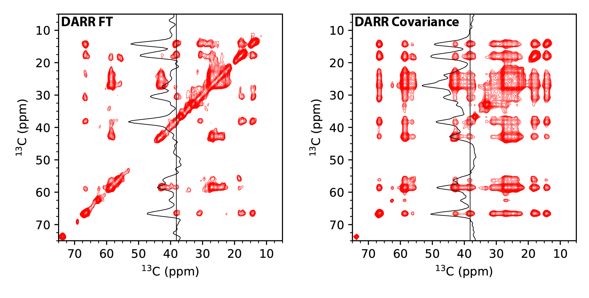

# DARR FT and Covariance processing using Nmrglue

## Instructions

1. Run the [fid.com](fid.com) to convert FID from Varian to NMRPipe format

2. Process the test.fid file using the [darr_proc.py](darr_proc.py) Python script:

		python3 darr_proc.py
	
	The script will out a FT and Covariance-processed spectrum in NMRipe format.

3. Plots below can be generated in Python using the [plot_darr.py](plot_darr.py) Python script:

		python3 plot_darr.py

